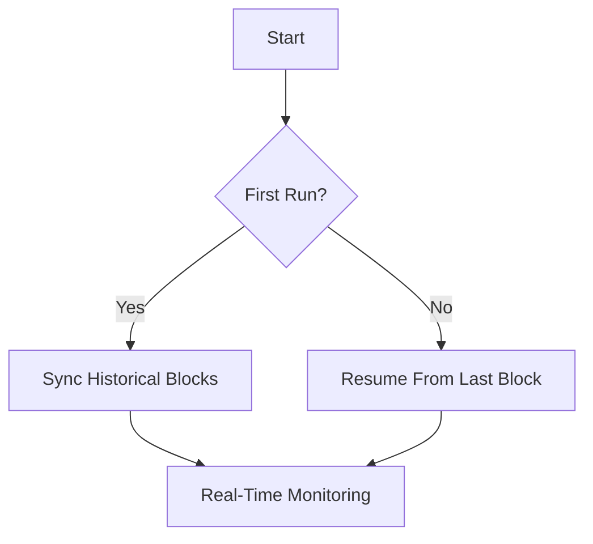

Here's a comprehensive technical documentation in Markdown format that you can save as `BLOCK_FETCHER_ARCHITECTURE.md`:

```markdown
# Ethereum Block Fetcher System Architecture

## Overview
A robust service that synchronizes Ethereum blockchain data to MongoDB, featuring:
- Historical block backfilling
- Real-time block monitoring
- Automatic resume capability
- Production-grade error handling

## Technical Specifications

### Core Components

#### 1. Fetcher Service (`internal/fetcher/block.go`)
```go
type Config struct {
    StartBlock   *int64        // Optional manual start block
    PollInterval time.Duration // Sync frequency (default: 12s)
    BatchSize    int64         // Blocks per batch (default: 100)
}
```

#### 2. Data Model (`internal/types/block.go`)
```go
type Block struct {
    Number      int64     `bson:"number"`     // Block number
    Hash        string    `bson:"hash"`       // Block hash
    ParentHash  string    `bson:"parentHash"` 
    Timestamp   time.Time `bson:"timestamp"`
    Miner       string    `bson:"miner"`      // Coinbase address
    GasUsed     uint64    `bson:"gasUsed"`
    GasLimit    uint64    `bson:"gasLimit"`
    BaseFee     uint64    `bson:"baseFee,omitempty"` // EIP-1559
    Difficulty  string    `bson:"difficulty"` // String for big numbers
    Size        uint64    `bson:"size"`
    TxCount     int       `bson:"txCount"`
    Uncles      []string  `bson:"uncles"`     // Uncle block hashes
    ExtraData   []byte    `bson:"extraData"`  // BinData format
}
```

### Synchronization Logic

#### Dual-Phase Architecture
1. **Historical Sync**
   - Processes blocks in configurable batches
   - Automatic gap detection
   - Retry mechanism (3 attempts with backoff)

2. **Real-Time Sync**
   - Polling interval configurable (default 12s)
   - Chain head tracking
   - Immediate new block processing



### Key Features

1. **Resilient Design**
   - Automatic recovery from crashes
   - Network error retry logic
   - Chain reorganization handling

2. **Performance Optimizations**
   - Bulk MongoDB upserts
   - Concurrent header/body fetching
   - Progress-aware batching

3. **Operational Controls**
   - Configurable start block
   - Adjustable sync speed
   - Graceful shutdown

### Deployment

#### Docker Compose Integration
```yaml
services:
  fetcher:
    image: golang:1.21-alpine
    environment:
      - RPC_URL=eth_node_url
      - MONGO_URI=mongodb://mongo:27017 
      - START_BLOCK=optional
    volumes:
      - ./go:/go/src/app
    command: >
      sh -c "go build -o fetcher ./cmd/fetcher && ./fetcher"
```

### Monitoring Metrics
| Metric                  | Type    | Description                          |
|-------------------------|---------|--------------------------------------|
| blocks_processed_total  | Counter | Total blocks synced                  |
| sync_lag_seconds        | Gauge   | Current chain head difference        |
| block_processing_time   | Summary | Time per block (ms)                 |
| db_operations_total     | Counter | MongoDB write operations            |

## Implementation Notes

1. **Context Propagation**
   - All operations support cancellation
   - Timeout handling for RPC calls
   - Graceful shutdown hooks

2. **Error Handling**
   - Differentiated error types:
     - Recoverable (retry)
     - Fatal (shutdown)
   - Context-aware error wrapping

3. **Data Safety**
   - Atomic MongoDB upserts
   - Block number unique indexing
   - Write confirmation checks

## Example Usage

```go
cfg := fetcher.Config{
    PollInterval: 15 * time.Second,
    BatchSize:    50,
} 

err := fetcher.Run(ctx, ethClient, mongoDB, cfg)
if err != nil {
    log.Fatal("Fetcher failed: ", err)
}
```

## Future Enhancements
1. WebSocket subscription mode
2. Prometheus metrics endpoint
3. Parallel historical sync
4. Configurable block validation
```